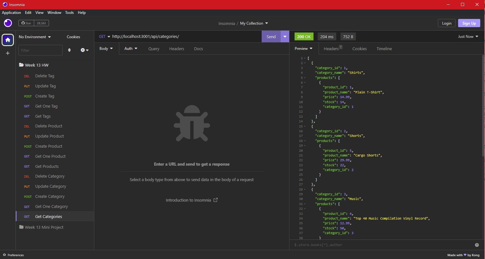
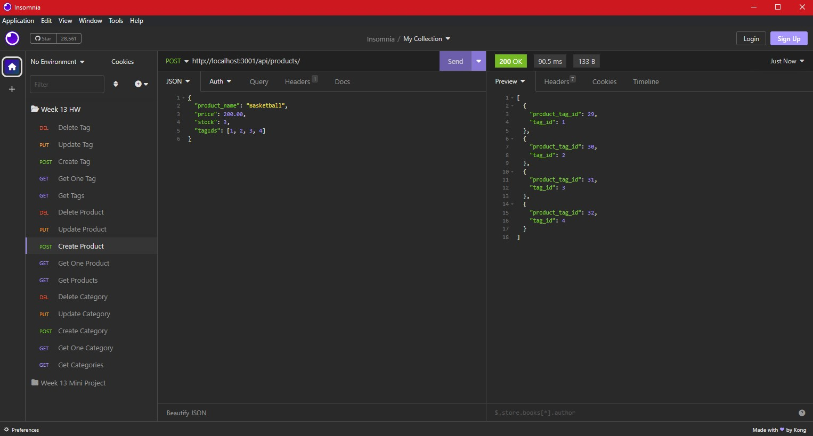
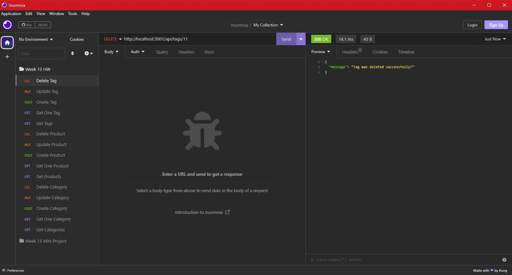

# E-Commerce-Back-End

## Description

In this project, I worked with a starter code for an Express.js API and configured it to use Sequelize for interacting with a MySQL database. The main goals of this project were to establish a database connection using Sequelize, create and seed a database with test data, and synchronize the Sequelize models with the MySQL database.

To accomplish this, I utilized Insomnia Core, a testing tool, to interact with the API routes. I tested the GET routes for categories, products, and tags to retrieve data from the database. Additionally, I tested the API's POST, PUT, and DELETE routes to create, update, and delete data within the database.

Throughout the project, I gained hands-on experience in establishing database connections using Sequelize and leveraging environment variables. I also learned how to create and configure Sequelize models for the database tables. Performing CRUD operations using Sequelize methods allowed me to manipulate data effectively. Furthermore, I practiced handling asynchronous operations using async/await syntax and implementing error handling with try...catch blocks.

## Table of Contents
1. [Installation](#installation)
2. [Usage](#usage)
3. [Credits](#credits)
4. [Questions](#questions)  
5. [License](#license)

## Installation
- Download and install the Node.js LTS version from [Node.js](https://nodejs.org/en).
- Clone the repo using:

        git clone git@github.com:Dinh282/e-commerce-back-end.git

 - Or download the code from https://github.com/Dinh282/e-commerce-back-end.git and
open it with VS Code.       
- Make sure you are in the root path of the project folder and then install dependencies for the project with:

        npm i

- You would also need to download MySQL and start your database. 
- Set up the connection to the database by editing the server.js file. 
- Make sure you create and edit the .env file to reflect your MySQL username and password; so that you can make a successful connection to the MySQL database.
- You must log in to your MySQL Shell and source the schema.sql file. You can do so using this command:

        source schema.sql;  

- Once finished, exit the MySQL Shell, and seed the database with this command(since we have an index.js file in our seeds folder node will know to run it with the following command):

        node seeds

- You also need a REST Client tool to test the APIs. You can download and use Insomnia for this at: https://insomnia.rest/download. 

## Usage

- Change the directory to the root of the project folder.
- Run the application with the following command:

        node server.js

- Test the API calls with Insomnia by making GET, POST, PUT, and DEL requests for different models at the routes defined in the index.js file of api directory inside routes.  

- Alternatively, you can view the demo video.

---

Video Demo of Application:

https://github.com/Dinh282/e-commerce-back-end/assets/112836220/cb70329a-5b53-4c60-a5bf-f4183cbb5cdc

 Screenshots of the Insomnia:

 GET Route For Category:

Post Route For Product:

Delete Route For Tag:

## Credits:

1. https://sequelize.org/v2/api/sequelize/ (Help with setting up models)

2. https://www.youtube.com/watch?v=li7FzDHYZpc (Help with async-await)

3. https://www.youtube.com/watch?v=670f71LTWpM (Help with async-await)

4. Instructor, TAs, and classmates.

## Questions
Feel free to contact me at nguyen_dinh282@yahoo.com for additional information.  
Also, check out my other projects on [GitHub](https://github.com/Dinh282)

## License

Please refer to the LICENSE section in the repository.

---
